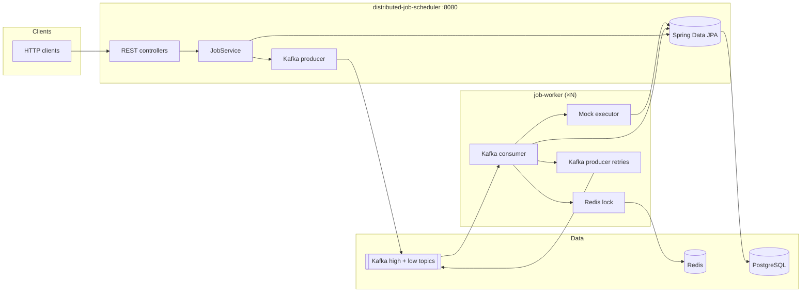
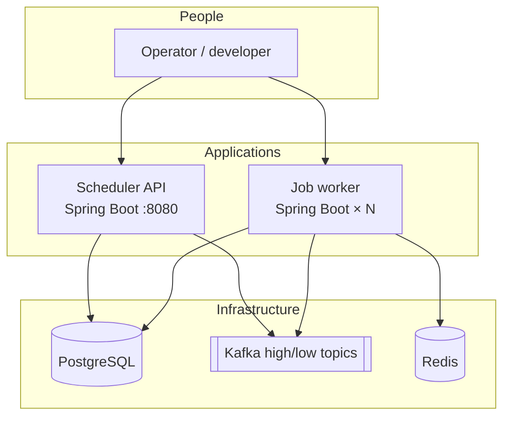
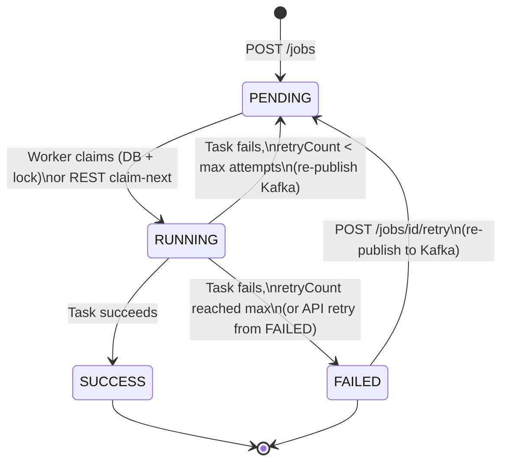
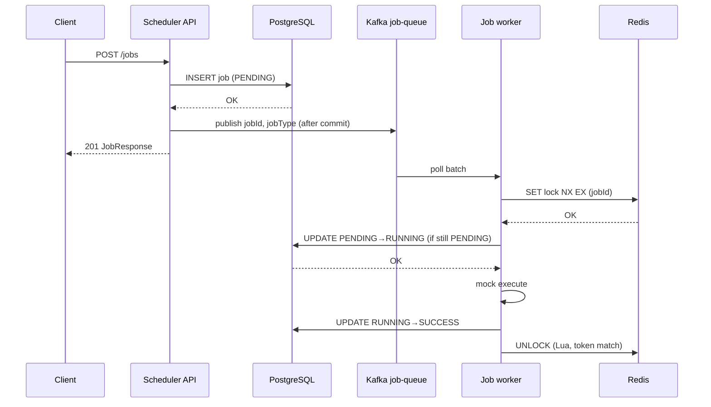
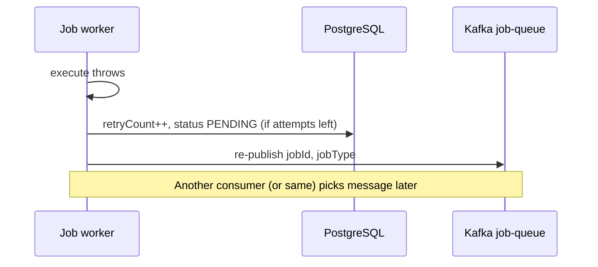

# Priority-aware async job pipeline

This project is built around a concrete backend problem: **urgent background work gets delayed when mixed with bulk work**.  
Example: a user-facing notification and a large report generation request should not have equal scheduling behavior.

Instead of a single queue with ad-hoc retries, this repo implements a small production-inspired pipeline:

- **Two priority lanes** (`HIGH`, `LOW`) with fair dispatch (**3:1**) so urgent work is preferred but low-priority work still progresses.
- **Durable state in Postgres** (`jobs` table) as system of record.
- **Kafka-based asynchronous execution** between API and worker.
- **Redis execution locks** to reduce duplicate processing when messages are redelivered.
- **Stale RUNNING recovery** to reclaim jobs left RUNNING after worker crashes.
- **Structured lifecycle logs** (`event=... jobId=...`) to make incident debugging easier.

**Stack:** Spring Boot 3 · Java 21 · PostgreSQL · Kafka · Redis · optional React (Vite) dashboard  
**Deep dive:** [Architecture & workflow](docs/ARCHITECTURE_AND_WORKFLOW.md)  
**Learning links:** [LEARNING_RESOURCES.md](docs/LEARNING_RESOURCES.md)

---

## Problem statement

When teams move synchronous work to background workers, three issues usually appear quickly:

1. **Priority inversion** — critical jobs wait behind low-value bulk jobs.
2. **Duplicate processing risk** — at-least-once messaging means the same job may be seen more than once.
3. **Operational blind spots** — hard to explain why a job is stuck or retried.

This repository focuses on those three issues with simple, explicit design choices.

| Service | Directory | Responsibility |
|---------|-----------|----------------|
| **Scheduler API** | [`distributed-job-scheduler/`](distributed-job-scheduler/) | `POST /jobs`, listing, Swagger; owns JPA schema; publishes to **`job-queue-high`** or **`job-queue-low`** after the DB transaction **commits**. |
| **Worker** | [`job-worker/`](job-worker/) | Two consumer groups + in-process **3 HIGH : 1 LOW** fair merge; **Redis lock** per `jobId`; `PENDING → RUNNING → SUCCESS/FAILED`; failures **re-publish** to the same priority topic until a cap. |
| **Dashboard** | [`job-dashboard/`](job-dashboard/) | React UI to watch job status (proxies to the API in dev). |

---

## Engineering decisions and tradeoffs

- **Priority via separate Kafka topics (`job-queue-high`, `job-queue-low`)**  
  Chosen for clarity and isolation of backlogs. Tradeoff: extra consumer/topic configuration.
- **Fair worker scheduling (3 HIGH : 1 LOW)**  
  Prevents LOW starvation while still favoring urgent jobs. Tradeoff: not strict latency guarantees.
- **Publish-to-Kafka after DB commit (`@TransactionalEventListener`)**  
  Avoids messaging jobs that never committed. Tradeoff: still not a full outbox table pattern.
- **DB claim + Redis lock together**  
  DB state machine remains source of truth; Redis reduces duplicate execution windows. Tradeoff: more moving parts than DB-only coordination.
- **Reclaim stale `RUNNING` jobs**  
  Worker can recover jobs stuck in RUNNING beyond a timeout (`JOB_WORKER_STALE_RUNNING_TIMEOUT_SECONDS`). Tradeoff: timeout must be tuned to avoid reclaiming genuinely long jobs.
- **Structured logging for lifecycle events**  
  `event=... jobId=... priority=...` logs improve troubleshooting and demo explainability. Tradeoff: requires log discipline.

---

## Table of contents

1. [Problem statement](#problem-statement)  
2. [Engineering decisions and tradeoffs](#engineering-decisions-and-tradeoffs)  
3. [How to verify everything works](#how-to-verify-everything-works)  
4. [Architecture overview](#architecture-overview)  
5. [System context diagram](#system-context-diagram)  
6. [Job lifecycle and state machine](#job-lifecycle-and-state-machine)  
7. [End-to-end workflows](#end-to-end-workflows)  
8. [REST API reference](#rest-api-reference)  
9. [Kafka message format](#kafka-message-format)  
10. [Priority-based Job Scheduling](#priority-based-job-scheduling)  
11. [Distributed locking (Redis)](#distributed-locking-redis)  
12. [Configuration and environment variables](#configuration-and-environment-variables)  
13. [Prerequisites](#prerequisites)  
14. [How to run](#how-to-run)  
15. [Project structure](#project-structure)  
16. [Design notes and limitations](#design-notes-and-limitations)  
17. [Troubleshooting](#troubleshooting)  

---

## Architecture overview

- **PostgreSQL** is the **system of record** for jobs (`jobs` table). Both services use the same database and table; the API owns schema evolution (`ddl-auto: update`), the worker validates schema (`ddl-auto: validate`).
- **Kafka** decouples submission from execution: after a successful DB commit, the API publishes a compact message to **`job-queue-high`** or **`job-queue-low`** based on **`JobPriority`**.
- **Workers** use **two consumer groups** (one per lane) and a **fair dispatcher** (up to **3 HIGH** messages per **1 LOW**) so HIGH is preferred without starving LOW. Before DB work they acquire a **Redis lock** keyed by `jobId`.
- **Retries** are **Kafka-driven** back to the **same** priority topic; after max failed execution attempts the job is **`FAILED`**.



---

## System context diagram

High-level actors and dependencies (renders on GitHub Mermaid):



---

## Job lifecycle and state machine

Jobs are rows in `jobs` with status:

| Status | Meaning |
|--------|---------|
| `PENDING` | Accepted; waiting to be claimed or consumed from Kafka. |
| `RUNNING` | A worker holds the row (or REST worker claimed it) and is executing. |
| `SUCCESS` | Completed successfully. |
| `FAILED` | Terminal failure (or exhausted retries on the worker path). |



**Note:** `POST /jobs/{id}/retry` is only valid for **FAILED** jobs: the row goes back to **PENDING**, **`retryCount`** increments, and the same **`JobCreatedEvent`** path runs **after commit**, so a new message lands on the correct **HIGH/LOW** topic.

---

## End-to-end workflows

### A. Create job (happy path)



### B. Task failure with Kafka retry



If **no attempts left**, the worker sets **`FAILED`** and does **not** re-publish.

---

## REST API reference

Base URL for the scheduler (default): `http://localhost:8080`

### Swagger UI (OpenAPI)

After starting **`distributed-job-scheduler`**, open interactive docs in the browser:

- **Swagger UI:** [http://localhost:8080/swagger-ui.html](http://localhost:8080/swagger-ui.html)
- **OpenAPI JSON:** [http://localhost:8080/v3/api-docs](http://localhost:8080/v3/api-docs)

You can **Try it out** on each endpoint the same way you would in Postman. The **`job-worker`** service has no HTTP API, so there is no Swagger for it.

### Public job API (`JobController`)

| Method | Path | Description |
|--------|------|-------------|
| `POST` | `/jobs` | Create a job. Body: `{ "jobType": string, "payload": JSON, "priority"?: "HIGH" \| "LOW" }`. **`priority`** optional; defaults to **LOW**. Returns **201** + job. Publishes to **high** or **low** Kafka topic after DB commit. |
| `GET` | `/jobs` | List all jobs (newest first by `createdAt`). |
| `GET` | `/jobs/{id}` | Job details. **404** if missing. |
| `POST` | `/jobs/{id}/retry` | Only if status is **FAILED**: set **PENDING**, increment `retryCount`, **re-publish to Kafka** on the job’s **same** priority topic. **400** if not failed. |

**Validation (`POST /jobs`):**

- `jobType`: required, non-blank, max length **255**.
- `payload`: required JSON object (any shape).
- `priority`: optional enum **`HIGH`** or **`LOW`**; omitted → **LOW** (backward compatible).

### Optional REST worker API (`WorkerJobController`)

Intended for **pull-based** workers (without Kafka). Same database rules apply.

| Method | Path | Description |
|--------|------|-------------|
| `POST` | `/api/workers/jobs/claim-next` | Atomically claims oldest **PENDING** job → **RUNNING** (DB locking / skip-locked style). **404** if none. |
| `POST` | `/api/workers/jobs/{id}/complete` | Body: `{ "status": "SUCCESS" \| "FAILED" }`. Only from **RUNNING**. |

**Conflict note:** Running **both** Kafka workers and REST `claim-next` on the same job set can race; for demos pick one execution path per environment.

---

## Kafka message format

- **Topics:** `job-queue-high` and `job-queue-low` (configurable; see [Configuration](#configuration-and-environment-variables)).
- **Key:** `jobId` (string UUID) — sticky partitioning per job.
- **Value:** JSON UTF-8 string:

```json
{
  "jobId": "550e8400-e29b-41d4-a716-446655440000",
  "jobType": "EMAIL",
  "priority": "HIGH"
}
```

`priority` is included for every new message. **Legacy** messages without `priority` deserialize as **LOW**.

---

## Priority-based Job Scheduling

### Why it exists

Not all background work is equally urgent. **Alerts, SLA-sensitive tasks, or user-blocking flows** should jump ahead of **best-effort** work (reports, batch enrichment). Priority lanes let you **bias throughput** toward urgent jobs while still **making progress** on low-priority queues.

### HIGH vs LOW

| Priority | Stored on `jobs.priority` | Kafka topic | Typical use |
|----------|---------------------------|-------------|-------------|
| **HIGH** | `HIGH` | `job-queue-high` | Time-sensitive or user-visible work |
| **LOW**  | `LOW` (default) | `job-queue-low` | Bulk / background work |

The API **routes** publishes after commit: `JobQueueKafkaProducer` selects the topic from `JobPriority`. The worker **never downgrades** priority on retry: failures re-publish to the **same** lane using the persisted `priority` on the job row.

### Kafka topic separation

- **Two topics** isolate backlogs: a flood of LOW jobs does not consume partition bandwidth from HIGH consumers in the same way a single mixed topic would.
- **Two consumer groups** (`job-worker-high`, `job-worker-low` by default) are required because Kafka consumer groups must share one subscription; each lane has its own `@KafkaListener` + group.
- In-process **`FairPriorityJobIngress`** merges both lanes with a **weighted** dispatch policy (below).

### Fairness mechanism (anti-starvation)

Pure “always drain HIGH first” can **starve** LOW if HIGH never stops arriving. This worker uses a fixed **3 : 1** pattern:

1. Serve up to **three** messages from the **HIGH** internal queue (each poll waits briefly so we do not busy-spin).
2. Then serve **one** message from the **LOW** queue.
3. If **no HIGH** was available in that cycle, we **immediately** try **LOW**, and if both are idle we **block** briefly on either queue.

So under heavy HIGH load the ratio trends to **3 HIGH : 1 LOW**; when HIGH is quiet, **LOW** still runs. See class-level Javadoc on  
[`FairPriorityJobIngress.java`](job-worker/src/main/java/com/distributedjob/worker/kafka/FairPriorityJobIngress.java).

---

## Distributed locking (Redis)

- **Key:** `app.worker.distributed-lock-key-prefix` + `jobId` (default prefix `job-worker:exec:`).
- **Acquire:** `SET` with **NX** and **TTL** so only one worker enters the critical section; TTL avoids deadlocks if a JVM dies.
- **Release:** Lua script compares a unique **token** then **DEL** so a delayed client cannot delete another owner’s lock.
- If the lock **is not** acquired, the worker **skips** processing for that message (another instance is responsible).

See class-level documentation in  
[`job-worker/.../JobDistributedLockService.java`](job-worker/src/main/java/com/distributedjob/worker/service/JobDistributedLockService.java).

---

## Configuration and environment variables

### Scheduler (`distributed-job-scheduler`)

| Variable / property | Default | Purpose |
|---------------------|---------|---------|
| `server.port` | `8080` | HTTP port |
| `DB_USERNAME` / `DB_PASSWORD` | `postgres` / `postgres` | PostgreSQL credentials |
| JDBC URL | `jdbc:postgresql://localhost:5432/jobscheduler` | Database |
| `KAFKA_BOOTSTRAP_SERVERS` | `localhost:9092` | Kafka brokers |
| `KAFKA_JOB_QUEUE_HIGH_TOPIC` | `job-queue-high` | HIGH priority producer topic |
| `KAFKA_JOB_QUEUE_LOW_TOPIC` | `job-queue-low` | LOW priority producer topic |
| `spring.jpa.hibernate.ddl-auto` | `update` | Schema management |

### Worker (`job-worker`)

| Variable / property | Default | Purpose |
|---------------------|---------|---------|
| `DB_*` | same as above | Same PostgreSQL DB |
| `KAFKA_BOOTSTRAP_SERVERS` | `localhost:9092` | Consumer + producer |
| `KAFKA_JOB_QUEUE_HIGH_TOPIC` | `job-queue-high` | HIGH lane subscribe + retry publish |
| `KAFKA_JOB_QUEUE_LOW_TOPIC` | `job-queue-low` | LOW lane subscribe + retry publish |
| `KAFKA_CONSUMER_GROUP_HIGH` | `job-worker-high` | Consumer group for HIGH topic |
| `KAFKA_CONSUMER_GROUP_LOW` | `job-worker-low` | Consumer group for LOW topic |
| `REDIS_HOST` / `REDIS_PORT` | `localhost` / `6379` | Redis for locks |
| `REDIS_PASSWORD` | empty | Optional auth |
| `JOB_WORKER_MAX_EXECUTION_ATTEMPTS` | `4` | Total failed **executions** before **FAILED** (default ≈ 1 initial + 3 Kafka retries) |
| `JOB_WORKER_LOCK_KEY_PREFIX` | `job-worker:exec:` | Redis key prefix |
| `JOB_WORKER_LOCK_TTL_SECONDS` | `600` | Lock TTL (seconds) |
| `spring.jpa.hibernate.ddl-auto` | `validate` | Expect existing schema |

---

## Prerequisites

- **Java 21** (matches both Maven modules’ `pom.xml`)
- **Maven 3.8+**
- **Docker** (optional but recommended) — for [`docker-compose.yml`](docker-compose.yml)
- Or install locally: **PostgreSQL 14+**, **Apache Kafka** (or compatible), **Redis 6+**

---

## How to run

### 1. Start infrastructure

From the repository root:

```bash
docker compose up -d
```

Wait until Postgres, Redis, and Kafka are healthy (Postgres healthcheck in compose; Kafka may need ~30s).

**Create database manually** (only if you use Postgres without the compose `POSTGRES_DB`):

```sql
CREATE DATABASE jobscheduler;
```

The compose file already sets `POSTGRES_DB=jobscheduler`, so this is usually unnecessary.

### 2. Start the scheduler API (creates / updates JPA schema)

```bash
cd distributed-job-scheduler
mvn spring-boot:run
```

API: `http://localhost:8080`

### 3. Start one or more workers

Open another terminal per worker:

```bash
cd job-worker
mvn spring-boot:run
```

Workers need:

- Kafka reachable
- Redis reachable
- Postgres with existing `jobs` table (**start the API at least once first** so `ddl-auto: update` creates tables)

**Optional — React dashboard:** from [`job-dashboard/`](job-dashboard/) run `npm install` and `npm start` (default **http://localhost:3000**). Vite proxies `/jobs` to the API; CORS is enabled on the API for ports 3000 and 5173.

### 4. Submit a test job

```bash
curl -s -X POST http://localhost:8080/jobs \
  -H "Content-Type: application/json" \
  -d '{"jobType":"EMAIL","payload":{"to":"user@example.com","subject":"Hello"}}'
```

List jobs:

```bash
curl -s http://localhost:8080/jobs
```

**Demo failure / retries:** use `"jobType":"FAILING_JOB"` and watch logs; after exhausting attempts the job becomes **FAILED** with increased `retryCount`.

### 5. Stop

```bash
# Ctrl+C on each Java process, then:
docker compose down
```

---

## How to verify everything works

Do this **after** [How to run](#how-to-run) (Docker infra + API + at least one worker). Treat each block as a pass/fail check.

### 1. API and database

1. **Create a job** (save the returned `id` if your shell supports it):

   ```bash
   curl -s -X POST http://localhost:8080/jobs \
     -H "Content-Type: application/json" \
     -d '{"jobType":"EMAIL","payload":{"to":"user@example.com","subject":"Hello"}}'
   ```

   **Expect:** HTTP **201** and JSON containing `"status":"PENDING"` (or already `"SUCCESS"` if the worker was very fast).

2. **List jobs:**

   ```bash
   curl -s http://localhost:8080/jobs | head -c 2000
   ```

   **Expect:** HTTP **200** and a JSON array that includes your job.

3. **Fetch one job by id** (replace `YOUR_JOB_UUID`):

   ```bash
   curl -s http://localhost:8080/jobs/YOUR_JOB_UUID
   ```

   **Expect:** HTTP **200** and fields `id`, `jobType`, `payload`, `status`, `retryCount`, `createdAt`, `updatedAt`.

**Pass criteria:** No connection errors; create and read behave as above.

---

### 2. Kafka + worker (happy path)

With the **worker terminal** visible:

1. Submit another **`EMAIL`** (or `REPORT`) job as above.

2. **Worker logs** — within a few seconds you should see lines similar to:

   - Acquired Redis lock / executing job … `type=EMAIL` or `[EMAIL] Mock send …`
   - `Job … completed successfully`

3. **API status** for that job’s id:

   ```bash
   curl -s http://localhost:8080/jobs/YOUR_JOB_UUID
   ```

   **Expect:** `"status":"SUCCESS"`.

**Pass criteria:** Status moves **PENDING → RUNNING → SUCCESS** (RUNNING may be too brief to catch in the API alone; worker logs are the main signal).

---

### 3. Retry path (`FAILING_JOB`)

1. Create a job with a type that **always fails** in the mock executor:

   ```bash
   curl -s -X POST http://localhost:8080/jobs \
     -H "Content-Type: application/json" \
     -d '{"jobType":"FAILING_JOB","payload":{"note":"retry demo"}}'
   ```

2. Watch **worker logs**: repeated failures, **re-published** messages to Kafka (log lines about re-publish), until attempts are exhausted.

3. **GET** that job by id:

   **Expect:** `"status":"FAILED"` and **`retryCount`** increased (default policy allows several execution attempts before terminal failure).

**Pass criteria:** Job ends **FAILED** after visible retry activity, not stuck **PENDING** forever.

---

### 4. Redis lock (optional, multi-worker)

1. Start a **second** worker in another terminal (`cd job-worker && mvn spring-boot:run`).

2. Submit several jobs quickly (loop or multiple `curl`s).

3. In logs, you may see **Skipping job … — Redis execution lock already held** on one instance while the other runs the same `jobId` — that is expected when duplicate or overlapping messages occur.

**Pass criteria:** No duplicate **successful** executions for the same job id in logs; at most one worker executes a given job at a time.

---

### 5. Quick “all green” checklist

| Check | How you know it’s OK |
|-------|----------------------|
| Postgres | API starts without DB errors; `GET /jobs` works. |
| Kafka | Worker receives messages after `POST /jobs` (worker logs). |
| Redis | Worker starts without Redis connection errors; locks appear under normal load. |
| End-to-end | `EMAIL` / `REPORT` jobs reach **SUCCESS** in the API. |
| Retries | `FAILING_JOB` ends **FAILED** with **retryCount** at least **1** after several tries. |

If any step fails, use [Troubleshooting](#troubleshooting) and confirm ports **5432**, **9092**, **6379** match your `docker compose` and env vars.

---

## Project structure

```text
.
├── README.md                 # This file
├── docker-compose.yml        # Postgres, Redis, Zookeeper, Kafka
├── job-dashboard/            # React + Tailwind + Axios UI (npm start)
├── distributed-job-scheduler/
│   ├── pom.xml
│   └── src/main/java/com/distributedjob/scheduler/
│       ├── DistributedJobSchedulerApplication.java
│       ├── controller/       # JobController, WorkerJobController
│       ├── service/          # JobService
│       ├── repository/       # JobRepository
│       ├── entity/           # Job, JobStatus, JobPriority
│       ├── dto/              # Request/response records
│       ├── kafka/            # Producer, after-commit publisher
│       └── config/           # Kafka topic bean
└── job-worker/
    ├── pom.xml
    └── src/main/java/com/distributedjob/worker/
        ├── JobWorkerApplication.java
        ├── controller/       # (none — Kafka-only)
        ├── service/          # Processing, state, lock, mock executor
        ├── repository/       # JobRepository (claim update)
        ├── entity/           # Job mirror for JPA validate
        ├── kafka/            # FairPriorityJobIngress, producer (retries)
        └── config/           # Kafka listener factory, WorkerProperties
```

---

## Design notes and limitations

- **Publish after commit:** Kafka send runs **after commit** via `TransactionalEventListener`. I did not build a separate outbox table; I know that is another pattern people use when they need stronger guarantees.
- **Kafka redelivery:** Messages can show up more than once; the worker uses a **DB state change** and a **Redis lock** to lower duplicate work, but I would not call this a full “exactly-once” story without more reading on my side.
- **API retry:** `POST /jobs/{id}/retry` moves the job to **PENDING** and **re-publishes** to the correct priority topic (same path as create).
- **Stuck RUNNING:** This repo now includes timeout-based reclaim for stale `RUNNING` jobs. Production systems typically add heartbeats and dedicated recovery/sweeper logic too.
- **Mock executor:** Real integrations would replace [`MockJobTaskExecutor`](job-worker/src/main/java/com/distributedjob/worker/service/MockJobTaskExecutor.java) with calls to email providers, report engines, etc.
- **Security:** No authentication on REST endpoints; add Spring Security for real deployments.

---

## Troubleshooting

| Symptom | Likely cause | What to do |
|---------|----------------|------------|
| Worker fails at startup with JPA / schema errors | `jobs` table missing | Run the **scheduler** once first (`ddl-auto: update`). |
| Worker cannot connect to Redis | Redis not running | `docker compose up -d` or start Redis; check `REDIS_HOST`. |
| No consumption from Kafka | Broker address wrong | `KAFKA_BOOTSTRAP_SERVERS`; from host use `localhost:9092` with provided compose. |
| Jobs stay PENDING, no worker logs | Consumer group lag / wrong topic | Confirm topics `job-queue-high` / `job-queue-low` exist and scheduler logs show a publish; worker uses groups `job-worker-high` / `job-worker-low`. |
| `FAILING_JOB` never goes SUCCESS | By design | Use a normal `jobType` for success path. |

---

## Why people use stacks like this

From what I have read, similar ideas show up wherever work is **too slow for the HTTP request** — emails, reports, payments post-processing, and so on. I am using this project to get comfortable with the moving parts, not to say I have solved all the hard distributed-systems problems.

## License

No license file is included in this demo repository; add one (e.g. MIT, Apache-2.0) if you publish or distribute the code.
