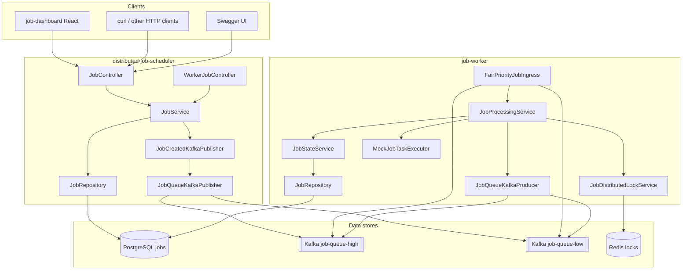

# Architecture and end-to-end workflow

This document describes **every major component** of the distributed job processing demo and how **requests, messages, and state** move through the system.

---

## 1. System overview

**Legend**

| Box | Role |
|-----|------|
| **distributed-job-scheduler** | HTTP API, owns DB schema (`ddl-auto: update`), publishes to Kafka **after** DB commit. |
| **job-worker** | Consumes Kafka (two lanes + fair merge), uses Redis + DB to execute jobs and handle retries. |
| **PostgreSQL** | Single source of truth for job rows (`jobs` table). |
| **Kafka** | Two topics for priority lanes; buffers work between API and workers. |
| **Redis** | Distributed lock per `jobId` to reduce duplicate execution across JVMs. |
| **job-dashboard** | Optional React UI; proxies `/jobs` to the API in dev. |

---

## 2. Components (by repository)

### 2.1 `distributed-job-scheduler` (API)

| Piece | Responsibility |
|-------|------------------|
| **`JobController`** (`/jobs`) | `POST` create, `GET` list, `GET /{id}`, `POST /{id}/retry`. |
| **`WorkerJobController`** (`/api/workers/jobs`) | Optional **pull** model: `claim-next`, `complete` — same DB, no Kafka in that path. |
| **`JobService`** | Business logic: validate, persist, publish `JobCreatedEvent`, claim/complete for REST workers. |
| **`Job` / `JobStatus` / `JobPriority`** | JPA entity + enums; maps to `jobs` table. |
| **`JobRepository`** | Spring Data JPA; `findPendingForClaim` orders **HIGH** first, then **createdAt** (for REST claim). |
| **`JobSubmissionRequest` / `JobResponse` / DTOs** | HTTP JSON contracts. |
| **`JobCreatedEvent`** | Published inside a transaction; carries `jobId`, `jobType`, `priority`. |
| **`JobCreatedKafkaPublisher`** | `@TransactionalEventListener(AFTER_COMMIT)` → calls producer only if DB commit succeeded. |
| **`JobQueueKafkaProducer`** | Serializes `JobQueueMessage` JSON; sends to **`job-queue-high`** or **`job-queue-low`** from `priority`. |
| **`JobQueueMessage`** | Kafka value: `{ jobId, jobType, priority }`; missing `priority` in JSON → **LOW**. |
| **`KafkaTopicConfig`** | Declares both topics (partitions/replicas for local dev). |
| **`KafkaTopicsProperties`** | `app.kafka.job-queue-high-topic`, `job-queue-low-topic`. |
| **`WebCorsConfig`** | Browser access from dashboard origins. |
| **`OpenApiConfig`** | Swagger / OpenAPI metadata. |

### 2.2 `job-worker`

| Piece | Responsibility |
|-------|------------------|
| **`FairPriorityJobIngress`** | Two `@KafkaListener`s (topics **high** / **low**, **different consumer groups**). Enqueues into in-memory **HIGH** / **LOW** queues; **daemon thread** runs **3 HIGH : 1 LOW** fair loop; **acks** Kafka only after `processQueuedJob` returns. |
| **`JobProcessingService`** | Orchestrates: **try Redis lock** → **claim PENDING→RUNNING** → **execute** → **SUCCESS** or **failure path** (re-publish or FAILED). |
| **`JobStateService`** | `@Transactional` DB updates: `tryClaimPending` (atomic update), `markSuccess`, `recordExecutionFailure` (increment `retryCount`, PENDING+requeue or FAILED). |
| **`JobDistributedLockService`** | Redis `SET NX EX` + token; Lua unlock; skip if lock held. |
| **`MockJobTaskExecutor`** | Simulates work: `EMAIL`, `REPORT`, `SLOW_JOB`, `FAILING_JOB`, generic. |
| **`JobQueueKafkaProducer`** | Retry publish to **same** topic as `message.priority()`. |
| **`Job` / mirror enums** | JPA `validate` against existing table; includes `priority`. |
| **`JobRepository`** | `claimIfStatus` bulk update for PENDING→RUNNING by id. |
| **`KafkaConsumerConfig`** | `priorityFairKafkaListenerContainerFactory`: concurrency **1**, **MANUAL** ack, **`syncCommits=false`** for cross-thread ack. |
| **`WorkerKafkaTopicsProperties` / `WorkerProperties`** | Topic names, consumer group ids, lock TTL, max execution attempts. |

### 2.3 `job-dashboard`

| Piece | Responsibility |
|-------|------------------|
| **`services/api.js`** | Axios: `GET/POST /jobs`; optional `VITE_API_BASE_URL` or dev proxy. |
| **`Dashboard.jsx`** | Polling **5s**, filters, summary counts, refresh button. |
| **`JobForm` / `JobTable` / `Filters`** | Create + table + client-side filter. |
| **`vite.config.js`** | `VITE_API_PROXY_TARGET` → proxy `/jobs`, `/api` to Spring. |

### 2.4 Infrastructure

| Component | Purpose |
|-----------|---------|
| **PostgreSQL** | Durable jobs; both apps use same DB name (`jobscheduler` by default). |
| **Kafka + Zookeeper** (or KRaft elsewhere) | Log-backed queues; API may auto-create topics. |
| **Redis** | Non-database coordination (locks). |

---

## 3. Data model (`jobs` table)

| Field | Meaning |
|-------|---------|
| `id` | UUID primary key. |
| `job_type` | Free-form string (e.g. `EMAIL`, `SLOW_JOB`). |
| `payload` | JSON (jsonb) — arbitrary parameters for workers. |
| `status` | `PENDING`, `RUNNING`, `SUCCESS`, `FAILED`. |
| `priority` | `HIGH` or `LOW` (default **LOW** for legacy rows). |
| `retry_count` | Incremented on API retry and on worker terminal failure path. |
| `created_at` / `updated_at` | Timestamps (UTC). |

---

## 4. End-to-end workflow: create job (Kafka path)

### Step A — HTTP request

1. Client **`POST /jobs`** with `jobType`, `payload`, optional `priority` (default **LOW**).
2. **`JobController`** → **`JobService.submitJob`** (transaction starts).

### Step B — Persist

3. **`Job`** row inserted: `status=PENDING`, `priority` set, `retryCount=0`.
4. **`ApplicationEventPublisher.publishEvent(new JobCreatedEvent(...))`** registered for **after commit**.

### Step C — After successful commit

5. **`JobCreatedKafkaPublisher.onJobQueuedForKafka`** runs (**AFTER_COMMIT** only).
6. **`JobQueueKafkaProducer.sendJobQueued`** chooses topic:
   - **HIGH** → `job-queue-high`
   - **LOW** → `job-queue-low`
7. Kafka broker stores the record; API returns **201** + **`JobResponse`** to the client.

**Why AFTER_COMMIT:** If the transaction **rolls back**, no Kafka message is sent — avoids “signal without row.”

### Step D — Worker ingress

8. **`FairPriorityJobIngress`**: one consumer group reads **high** topic, another reads **low** topic.
9. Each message is placed in an internal **HIGH** or **LOW** `LinkedBlockingQueue` (payload + `Acknowledgment` not yet acked).

### Step E — Fair dispatch thread

10. Loop: up to **3** messages from HIGH queue (short timeouts), then **1** from LOW; anti-starvation when HIGH empty.
11. For each item: parse JSON → **`JobQueueMessage`**, call **`JobProcessingService.processQueuedJob`**.
12. When processing finishes (success or handled failure path), **`acknowledgment.acknowledge()`** runs.

### Step F — Processing one message

13. **`JobDistributedLockService.tryLock(jobId)`** — Redis key `prefix + jobId`. If not acquired, **return** (another worker may own it).
14. **`JobStateService.tryClaimPending`**: JPQL/SQL update `PENDING`→`RUNNING` for that id; if **0 rows**, release lock and exit (duplicate message or state drift).
15. **`MockJobTaskExecutor.execute(job)`** — logs / sleep / throw per `jobType`.
16. On success: **`markSuccess`** → `SUCCESS`.
17. On exception: **`recordExecutionFailure`**:
    - Increment **`retryCount`**.
    - If **`retryCount < maxExecutionAttempts`**: set **`PENDING`**, **`JobQueueKafkaProducer`** republishes **same** `priority` topic.
    - Else: **`FAILED`**.
18. **`unlock`** Redis in **`finally`**.

---

## 5. Alternate workflow: REST worker (`WorkerJobController`)

- **`POST /api/workers/jobs/claim-next`**: uses **`JobRepository.findPendingForClaim`** (HIGH first, FIFO) + pessimistic lock / skip-locked pattern, then sets **RUNNING** in service.
- **`POST /api/workers/jobs/{id}/complete`**: sets **SUCCESS** or **FAILED** from **RUNNING**.

**Note:** Mixing heavy **Kafka workers** and **REST claim** on the same job set can race; use one execution style per environment for predictable demos.

---

## 6. API retry (`POST /jobs/{id}/retry`)

1. Only if **`FAILED`**.
2. **`PENDING`**, **`retryCount++`**, save.
3. **`JobCreatedEvent`** again → **same** Kafka lane as stored **`priority`**.

---

## 7. Configuration touchpoints (quick reference)

| Concern | Where |
|---------|--------|
| DB URL / user / password | Both `application.yml`, env `DB_*`, `SPRING_DATASOURCE_*` |
| API port | `SERVER_PORT`, `server.port` |
| Kafka bootstrap | `KAFKA_BOOTSTRAP_SERVERS` |
| Topic names | `KAFKA_JOB_QUEUE_HIGH_TOPIC`, `KAFKA_JOB_QUEUE_LOW_TOPIC`, `app.kafka.*` |
| Worker consumer groups | `KAFKA_CONSUMER_GROUP_HIGH`, `LOW`, `app.kafka.consumer-groups` |
| Redis | `REDIS_HOST`, `REDIS_PORT`, `REDIS_PASSWORD` |
| Max worker attempts | `JOB_WORKER_MAX_EXECUTION_ATTEMPTS` |
| Lock TTL / prefix | `JOB_WORKER_LOCK_TTL_SECONDS`, `JOB_WORKER_LOCK_KEY_PREFIX` |
| Dashboard → API | `VITE_API_PROXY_TARGET`, `VITE_API_BASE_URL` |

---

## 8. Operational semantics (interview-style)

- **At-least-once Kafka:** duplicates possible; **DB claim** + **Redis lock** mitigate double execution.
- **Ordering:** Per-partition order only; **fair ingress** adds app-level priority between two topics.
- **Durability:** Postgres survives broker/worker restarts; **stuck RUNNING** if a worker dies mid-flight is a known production follow-up (timeouts, reclaim).
- **Idempotency:** Not fully generic; design assumes **one logical completion** per job id via state machine.

---

## 9. Related files in repo

| Doc / script | Purpose |
|--------------|---------|
| [README.md](../README.md) | Runbook, diagrams, API tables, priority section |
| [scripts/demo-burst-jobs.sh](../scripts/demo-burst-jobs.sh) | Burst `POST /jobs` for load demos |

---

*Last updated to match this repository (Spring Boot 3.2, Java 21 in scheduler POM where applicable, dual Kafka topics, fair worker ingress, Redis locks, optional React dashboard).*
